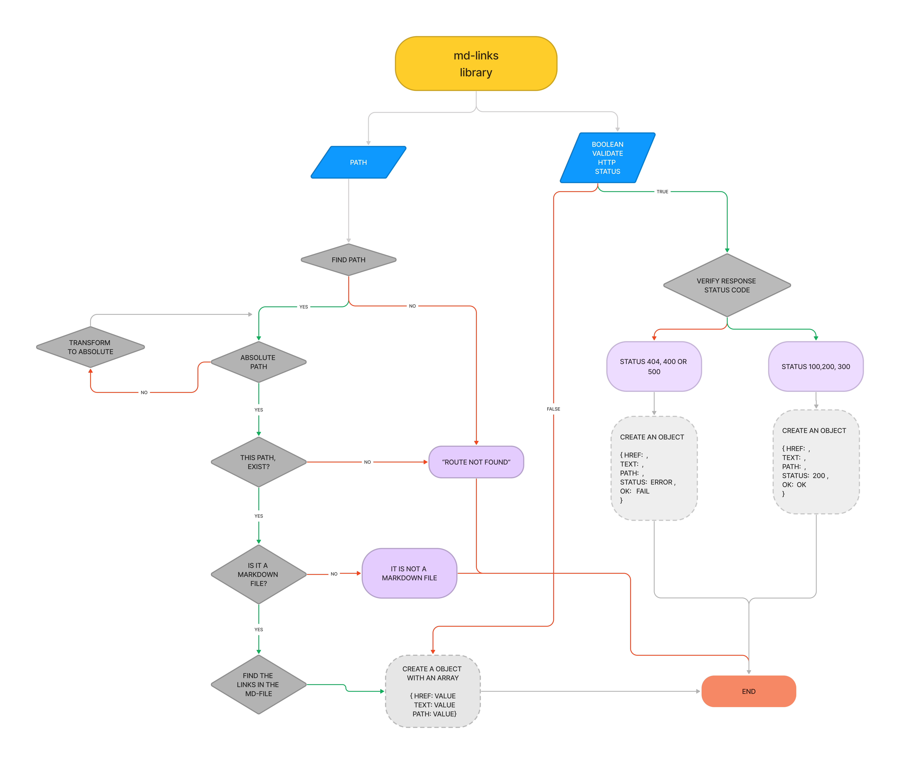

# Markdown Links
 

## Índice

* [1. Preámbulo](#1-preámbulo)
* [2. Descripción del módulo](#2-descripción-del-módulo)
* [3. Instrucciones de instalación](#3-instrucciones-de-instalación)
* [4. Diagrama de flujo](#4-diagrama-de-flujo)
* [5. Ejemplos de Uso](#5-ejemplos-de-uso)
* [6. Créditos](#6-créditos)
* [7. Licencia](#6-licencia)


***

## 1. Preámbulo

[Markdown](https://es.wikipedia.org/wiki/Markdown) es un lenguaje de marcado
ligero muy popular entre developers. Es usado en muchísimas plataformas que manejan texto plano (GitHub, foros, blogs, etc.) y
es muy común encontrar varios archivos en ese formato en cualquier tipo de
repositorio (empezando por el tradicional `README.md`).

Estos archivos `Markdown` normalmente contienen _links_ (vínculos/ligas) que
muchas veces están rotos o ya no son válidos y eso perjudica mucho el valor de
la información que se quiere compartir.

Dentro de una comunidad de código abierto, nos han propuesto crear una
herramienta usando [Node.js](https://nodejs.org/), que lea y analice archivos
en formato `Markdown`, para verificar los links que contengan y reportar
algunas estadísticas.

## 2. Descripción del módulo

Este proyecto es una librería en Node.js que funciona como
herramienta para analizar links dentro de archivos Markdown. Esta librería
está disponible de dos formas: como un módulo publicado en GitHub, que las
usuarias podrán instalar e importar en otros proyectos, y como una interfaz
de línea de comandos (CLI) que permitirá utilizar la librería directamente
desde el terminal.

[Node.js](https://nodejs.org/es/) es un entorno de ejecución para JavaScript
construido con el [motor de JavaScript V8 de Chrome](https://developers.google.com/v8/).
Esto nos va a permitir ejecutar JavaScript en el entorno del sistema operativo,
ya sea tu máquina o un servidor, lo cual nos abre las puertas para poder
interactuar con el sistema en sí, archivos, redes, etc.

## 3. Instrucciones de instalación


Usa el siguiente código tendrás que tener instalado `Node`.js previously installed in version `>=16`,

```
$ node -v
v18.16.1
```

Después deberás clonar este repositorio e instalar las dependencias. 

```
$ git clone https://github.com/MarianneTeixido/DEV010-md-links.git
$ cd DEV010-md-links.git
$ npm install
```

Finalmente puedes añadir en tu proyecto lo contenido dentro de la carpeta
__/lib__ la cual contiene los archivos necesarios para su ejecución. 

## 4. Diagrama de flujo




## 5. Ejemplos de Uso

Para usar esta librería deberás impotarla como un módulo en tu código usando CommonJS

```javascript
const mdlinks = require('./lib/mdlinks');
```

Considera que deberás cambiar la forma de impotación si usas ES Modules.

Con el módulo importado en tu proyecto podrás llamar a la función `mdlinks()` la cual acepta dos parámetros: `path` y `validate`. 

- `path`: Recibe la ruta de tu archivo markdown. Puede leer la ruta absoluta o relativa de un archivo en particular. También puedes pasar la ruta de una carpeta y la función leerá todos los archivos tipo markdown que encuentre al interior. 

- `validate`: Es un parámetro boleano opcional que puedes agregar para validar el código de status de HTTP. Por default mdlinks se ejecuta con validate declarado como _false_.

Al usar la función `mdlinks()` de esta librería usando sólo el parámetro `path`, este te devolverá en la consola un objeto con las propiedades `href`,`text` y `path`. 

Ejemplo: 

```javascript
 mdlinks('./examples/readme.md')
   .then((links) => {
     console.log(links); 
   })
      .catch((error) => {
     console.error(error);
   });
```

Al usar la función `mdlinks()` de esta librería usando el parámetro `path` y `validate`, este te devolverá en la consola un objeto con las propiedades `href`,`text`, `path`,`status` y `ok`. 

`status` mostrará el estado del código de respuesta HTTP y `ok` mostrará _ok_ si el código de respuesta es válido y _fail_ si no es válido. 

Ejemplo: 

```javascript
mdlinks("./examples/readme.md", true )
  .then(links => {
    console.log(links);
  })
  .catch(console.error);
  ```

Nota: Recuerda que puedes pasar un directorio a la ruta y este leerá los archivos markdown dentro. Sólo no leerá otros directorios dentro de un directorio ya existente. 

## 6. Créditos

Librería desarrollada por Marianne Teixido.  


## 7. Licencia

GNU General Public License v3.0 or later
